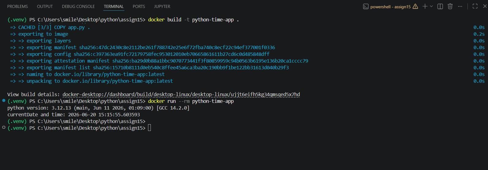

Dockerized python application
Question:
Create a Dockerized Python application that uses the python:3.12-slim image as the base image. Develop a Python script that prints the current Python version running inside the container along with the current date and time. Create a Dockerfile that copies the Python script into the container and executes it automatically when the container starts. The application should successfully build and run using Docker commands. Push the complete project, including the Python script, Dockerfile, requirements file (if required), and README documentation, to a GitHub repository. The README should contain instructions for building and running the Docker image and should include a sample output screenshot.

file structure:
 assign15
|
|──app.py
|──dockerfile
|──output.png
|──README.MD

build instruction for docker image
docker build -t python-time-app .

run instruction for docker container
docker run --rm python-time-app

sample output
python version: 3.12.13 (main, Jun 11 2026, 01:09:00) [GCC 14.2.0]
currentDate and time: 2026-06-20 15:15:55.603593

sample outpu screenshot

base image
python:3.12-slim